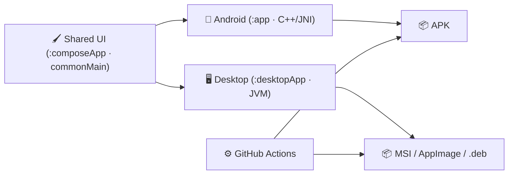
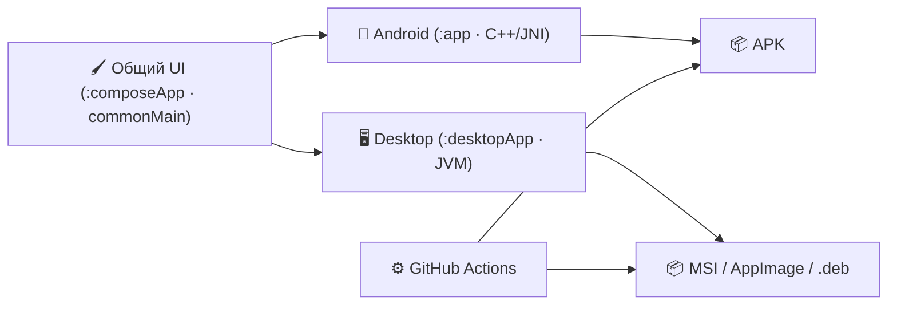
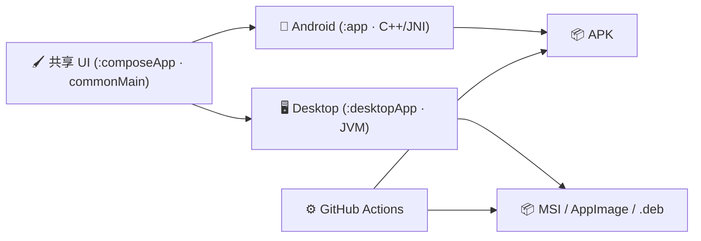

<div align="center">

# 🛰️ AZRAEL-APP

**A cross-platform client for the [azrael-lab.xyz](https://azrael-lab.xyz/) platform** — one shared UI, three platforms.

[](https://github.com/PAF-DE0H1SS/AZRAEL-APP/releases)
[](https://github.com/PAF-DE0H1SS/AZRAEL-APP/releases)
[](https://github.com/PAF-DE0H1SS/AZRAEL-APP/releases)
[](https://kotlinlang.org)
[](https://www.jetbrains.com/lp/compose-multiplatform/)
[](LICENSE)
[](https://github.com/PAF-DE0H1SS/AZRAEL-APP/actions)

</div>

> [!IMPORTANT]
> **Status: active development.** The app is in an early stage (WIP) — it may **not work at all** or work with bugs and glitches.

AZRAEL-APP is a small cross-platform application built with **Compose Multiplatform**. It connects to and interacts with the [azrael-lab.xyz](https://azrael-lab.xyz/) project. The same Compose UI is shared between the native Android build and the desktop builds — the native layer (C++/JNI) lives in `app`, the shared UI in `composeApp`, and the desktop wrapper in `desktopApp`.

---

## Language / Язык / 语言

<details open>
<summary><b>🇬🇧 English</b></summary>

### ✨ Overview

> [!NOTE]
> **Supported platforms** — same codebase, three delivery formats:

| 🖥️ Platform | 📦 Delivery | 🗂️ Format |
|---|---|---|
| 📱 **Android 13+** | APK — debug & release | `.apk` |
| 🖥️ **Windows 10/11** | MSI installer | `.msi` |
| 🐧 **Linux** | Ubuntu / Debian · Arch · NixOS | `.deb` · `PKGBUILD` · `flake` |

### 🧭 Architecture



The C++/native bridge stays **Android-only**; the desktop build uses a platform-aware fallback — the UI is fully shared.

### 🔨 Build

> [!TIP]
> Use the single script for everything: `./build-all.sh [release|dev|linux]`

<details open>
<summary><b>Android</b></summary>

```bash
./gradlew :app:assembleDebug
./gradlew :app:assembleRelease   # R8 minify + resource shrink
```

APKs land in `app/build/outputs/apk/`.
</details>

<details>
<summary><b>Windows MSI</b></summary>

*Run on a Windows host:*

```powershell
.\gradlew.bat :desktopApp:packageMsi
```

Artifact: `build\dist\AZRAEL-win10-11.msi`.
</details>

<details>
<summary><b>Linux</b></summary>

```bash
./gradlew :desktopApp:packageAppImage :desktopApp:packageDeb
```

<details>
<summary><b>🐧 NixOS</b></summary>

Run straight from the flake:

```bash
nix run github:PAF-DE0H1SS/AZRAEL-APP
```

Or build locally (Gradle needs network access):

```bash
nix build . --option sandbox false
nix run .
```

Development shell with JDK / CMake / Ninja:

```bash
nix develop
```
</details>

<details>
<summary><b>🐧 Arch</b></summary>

```bash
makepkg -si
```
</details>
</details>

### ✅ Roadmap

> [!NOTE]
> Current progress and plans:

- [x] Shared Compose Multiplatform UI (Android + Desktop)
- [x] Native C++/JNI layer for Android
- [x] CI auto-build: APK · MSI · AppImage · deb on tag `v*`
- [x] Dual licensing (PolyForm NC 1.0.0 + author terms)
- [ ] Sign release APK (keystore)
- [ ] Windows 10/11 testing on real hardware
- [ ] Emulator smoke tests (S21 Ultra API 36 AVD)
- [ ] Stable release `v1.0.x`

### 🌿 Branches

| Branch | Purpose |
|---|---|
| `main` | **stable** — released |
| `develop` | integration |
| `feature/*`, `release/*`, `hotfix/*` | as needed |

### 📄 License

Distributed under **hybrid dual licensing** — see [LICENSE](LICENSE):

- **Noncommercial use** → [PolyForm Noncommercial 1.0.0](https://polyformproject.org/licenses/noncommercial/1.0.0) (full text in Part 4)
- **Forks / monetization** → author terms (Parts 1–3): revenue share **≥ 50%**, back-feed clause, CLA

Commercial use requires a written agreement with the author: <typ.onepatop@gmail.com>.

</details>

<details>
<summary><b>🇷🇺 Русский</b></summary>

### ✨ Обзор

> [!NOTE]
> **Поддерживаемые платформы** — одна кодовая база, три формата поставки:

| 🖥️ Платформа | 📦 Поставка | 🗂️ Формат |
|---|---|---|
| 📱 **Android 13+** | APK — debug и release | `.apk` |
| 🖥️ **Windows 10/11** | установщик MSI | `.msi` |
| 🐧 **Linux** | Ubuntu / Debian · Arch · NixOS | `.deb` · `PKGBUILD` · `flake` |

### 🧭 Архитектура



Нативный слой C++/JNI остаётся **только для Android**; desktop-сборка использует fallback — UI полностью общий.

### 🔨 Сборка

> [!TIP]
> Всё одним скриптом: `./build-all.sh [release|dev|linux]`

<details open>
<summary><b>Android</b></summary>

```bash
./gradlew :app:assembleDebug
./gradlew :app:assembleRelease   # R8 minify + shrink ресурсов
```

APK появятся в `app/build/outputs/apk/`.
</details>

<details>
<summary><b>Windows MSI</b></summary>

*Собирается на Windows-хосте:*

```powershell
.\gradlew.bat :desktopApp:packageMsi
```

Артефакт: `build\dist\AZRAEL-win10-11.msi`.
</details>

<details>
<summary><b>Linux</b></summary>

```bash
./gradlew :desktopApp:packageAppImage :desktopApp:packageDeb
```

<details>
<summary><b>🐧 NixOS</b></summary>

Запуск прямо из флейка:

```bash
nix run github:PAF-DE0H1SS/AZRAEL-APP
```

Локальная сборка (Gradle требует сетевой доступ):

```bash
nix build . --option sandbox false
nix run .
```

Dev-окружение с JDK / CMake / Ninja:

```bash
nix develop
```
</details>

<details>
<summary><b>🐧 Arch</b></summary>

```bash
makepkg -si
```
</details>
</details>

### ✅ План развития

> [!NOTE]
> Текущий прогресс и планы:

- [x] Общий UI на Compose Multiplatform (Android + Desktop)
- [x] Нативный слой C++/JNI для Android
- [x] CI-автосборка: APK · MSI · AppImage · deb на теге `v*`
- [x] Двойное лицензирование (PolyForm NC 1.0.0 + условия автора)
- [ ] Подпись release-APK (keystore)
- [ ] Тест на реальном Windows 10/11
- [ ] Smoke-тесты на эмуляторе (AVD S21 Ultra API 36)
- [ ] Стабильный релиз `v1.0.x`

### 🌿 Ветки

| Ветка | Назначение |
|---|---|
| `main` | **стабильная** — релизная |
| `develop` | интеграционная |
| `feature/*`, `release/*`, `hotfix/*` | по ситуации |

### 📄 Лицензия

Распространяется по **гибридному двойному лицензированию** — см. [LICENSE](LICENSE):

- **Некоммерческое использование** → [PolyForm Noncommercial 1.0.0](https://polyformproject.org/licenses/noncommercial/1.0.0) (полный текст в Части 4)
- **Форки / монетизация** → условия автора (Части 1–3): revenue share **от 50%**, back-feed clause, CLA

Коммерческое использование требует письменного договора с автором: <typ.onepatop@gmail.com>.

</details>

<details>
<summary><b>🇨🇳 中文</b></summary>

### ✨ 概述

> [!NOTE]
> **支持的平台** — 同一套代码，三种交付格式：

| 🖥️ 平台 | 📦 交付 | 🗂️ 格式 |
|---|---|---|
| 📱 **Android 13+** | APK — debug 与 release | `.apk` |
| 🖥️ **Windows 10/11** | MSI 安装包 | `.msi` |
| 🐧 **Linux** | Ubuntu / Debian · Arch · NixOS | `.deb` · `PKGBUILD` · `flake` |

### 🧭 架构



原生层 C++/JNI 仅用于 **Android**；桌面版使用平台回退——UI 完全共享。

### 🔨 构建

> [!TIP]
> 一条命令搞定：`./build-all.sh [release|dev|linux]`

<details open>
<summary><b>Android</b></summary>

```bash
./gradlew :app:assembleDebug
./gradlew :app:assembleRelease   # R8 混淆 + 资源压缩
```

APK 输出在 `app/build/outputs/apk/`。
</details>

<details>
<summary><b>Windows MSI</b></summary>

*请在 Windows 主机上构建：*

```powershell
.\gradlew.bat :desktopApp:packageMsi
```

产物：`build\dist\AZRAEL-win10-11.msi`。
</details>

<details>
<summary><b>Linux</b></summary>

```bash
./gradlew :desktopApp:packageAppImage :desktopApp:packageDeb
```

<details>
<summary><b>🐧 NixOS</b></summary>

直接从 flake 运行：

```bash
nix run github:PAF-DE0H1SS/AZRAEL-APP
```

或本地构建（Gradle 需要网络）：

```bash
nix build . --option sandbox false
nix run .
```

开发环境（JDK / CMake / Ninja）：

```bash
nix develop
```
</details>

<details>
<summary><b>🐧 Arch</b></summary>

```bash
makepkg -si
```
</details>
</details>

### ✅ 路线图

> [!NOTE]
> 当前进度与计划：

- [x] Compose Multiplatform 共享 UI（Android + Desktop）
- [x] Android 原生层 C++/JNI
- [x] CI 自动构建：`v*` 标签 → APK · MSI · AppImage · deb
- [x] 双重许可（PolyForm NC 1.0.0 + 作者条款）
- [ ] 签名 release APK（keystore）
- [ ] 在真实 Windows 10/11 上测试
- [ ] 模拟器冒烟测试（AVD S21 Ultra API 36）
- [ ] 稳定版 `v1.0.x`

### 🌿 分支

| 分支 | 用途 |
|---|---|
| `main` | **稳定版** — 已发布 |
| `develop` | 集成分支 |
| `feature/*`、`release/*`、`hotfix/*` | 按需使用 |

### 📄 许可证

采用**混合双重许可**发布 — 见 [LICENSE](LICENSE)：

- **非商业用途** → [PolyForm Noncommercial 1.0.0](https://polyformproject.org/licenses/noncommercial/1.0.0)（完整文本见第 4 部分）
- **分支 / 商业变现** → 作者条款（第 1–3 部分）：收益分成不低于 **50%**、回馈条款（Back-feed）、CLA

商业使用需与作者签订书面协议：<typ.onepatop@gmail.com>。

</details>

---

<div align="center">

**AZRAEL-APP** · client for [azrael-lab.xyz](https://azrael-lab.xyz/) · [Actions](https://github.com/PAF-DE0H1SS/AZRAEL-APP/actions) · [Releases](https://github.com/PAF-DE0H1SS/AZRAEL-APP/releases) · [LICENSE](LICENSE)

</div>